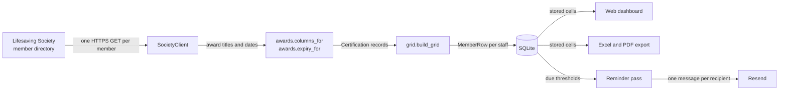
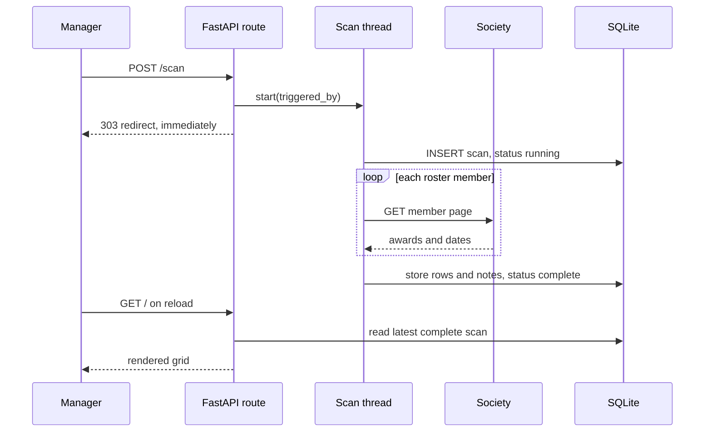

# Architecture

Written for someone about to modify the code. The organising idea is that the Lifesaving
Society publishes award titles and certification dates but no expiry dates, so expiry is
computed here — and almost every design decision below follows from that.

## Overview

A scan is the only thing that touches the network. Everything else reads stored results
out of SQLite, so the dashboard, the exports, and the reminder pass all agree with each
other by construction.



## Components

### Award mapping

`lss_report/awards.py` is the heart of correctness. It defines the six tracked columns
with their validity periods, and an **ordered** list of regular expressions mapping an
award title onto zero or more columns. The first pattern that matches wins.

Order carries real meaning. Exclusions come first, so `Lifesaving CPR Instructor/Examiner`
is not read as a CPR-C certification and `2023 National Lifeguard Update` is not read as a
National Lifeguard certification. `Swim Instructor` and `Lifesaving Instructor` are matched
before the generic instructor exclusion, because they are the two instructor awards that
*are* tracked.

A mapping can be marked **provisional**, meaning the award counts towards a column only as
a side effect. A CPR-C award credits first aid provisionally under Aquatic Centre policy; a
purpose-issued first aid award outranks it.

`columns_for` distinguishes three outcomes, and the difference matters downstream:

| Return | Meaning |
|---|---|
| `None` | The title matched no rule. It goes to diagnostics as an unmapped award. |
| `()` | Recognised, but not tracked on the grid — `Bronze Cross`, an exam clinic. |
| Non-empty | One or more `(column, provisional)` pairs. |

### The collector

`SocietyClient.fetch` performs one HTTPS request per member, spaced 1.1 seconds apart,
retrying twice on 429 and 5xx while honouring `Retry-After`. A 302 back to the directory
index means the member ID does not exist, and becomes a per-row error rather than an
exception that kills the scan.

`parse_member_page` reads the identity block and each certification card. A member ID
mismatch is a hard error — the Society returned somebody else. A **name** mismatch is only
a warning, because the roster genuinely contains typos and blanking those rows would lose
real certification data.

Cards come in two shapes. A current card carries a `Certification Date`. Some expired cards
carry only an `Expired On` value, which is worked backwards through the column's validity
period so every column derives its expiry the same way.

### Row building

`grid.build_grid` turns records into rows. Per column it picks the best award: a confirmed
mapping beats a provisional one, and otherwise the latest expiry wins, which is how an
original plus two recerts collapses into one cell.

Status thresholds, as of the scan date:

| Status | Condition |
|---|---|
| `EXPIRED` | Expiry is before today |
| `EXPIRING` | Expiry is within 30 days |
| `CURRENT` | Anything later |
| `MISSING` | No award on record for that column |

It also cross-checks each computed status against the Society's own `card--expired` class
and records disagreements. `FA` and `CPR-C` are excluded from that check, because house
policy is shorter than the Society's and every staff member would otherwise disagree.

### Renderers

`excel.py` and `pdf.py` are two renderers over the same `Grid`. `theme.py` holds the fill
colours sampled from the original hand-maintained form, so the generated sheet matches what
staff already read. The PDF is portrait letter, sized so the whole overview fits one page.

### The web application

| Module | Responsibility |
|---|---|
| `settings.py` | Environment parsing and validation. Frozen dataclass; the manager allowlist lives here. |
| `db.py` | One shared `sqlite3` connection guarded by an `RLock`. |
| `repository.py` | All SQL. `StaffRepository` owns the roster; `ScanRepository` owns scans, results, notes, and the reminder schedule. |
| `auth.py` | Magic-link issue and redeem, rate limiting, signed session cookies. |
| `scans.py` | `verify_member_code` for roster entry, `run_scan`, and `ScanRunner` — the worker thread. |
| `notify.py` | The `Channel` protocol, the Resend email channel, and reminder deduplication. |
| `scheduler.py` | A daemon thread ticking once a minute, firing the weekly scan and the daily reminder pass. |
| `app.py` | Route definitions and dependency wiring. |
| `server.py` | The `lss-web` entry point: argument parsing, seeding, uvicorn. |

## Data flow

A scan is asynchronous. The HTTP request that starts it returns immediately, because 45
lookups at 1.1 seconds each take about a minute.



Only one scan runs at a time — `ScanRunner` holds a lock and refuses to start a second.
The scheduler additionally claims the day in memory before starting, because the worker
thread writes its scan row asynchronously and the database guard alone can miss a fast
second tick.

### Database schema

Eight tables, created with `CREATE TABLE IF NOT EXISTS` on every startup. There is no
migration system.

| Table | Holds |
|---|---|
| `staff` | The roster of record. Soft-deleted via `removed_at`. |
| `scan` | One row per scan: start, finish, status, who triggered it. |
| `scan_result` | One row per staff member per column: expiry, status, source award, provisional flag. |
| `scan_note` | Diagnostics for a scan, keyed by kind: `error`, `name`, `unmapped`, `disagreement`. |
| `login_token` | Hashed single-use sign-in tokens with an expiry. |
| `login_attempt` | Rate-limit ledger, keyed by address and by client IP. |
| `notification_log` | Every reminder sent. Doubles as the deduplication key. |
| `audit` | Every roster change, with actor and timestamp. |

Two indexes carry design intent rather than performance:

```sql
CREATE UNIQUE INDEX staff_active_code
    ON staff (member_code) WHERE removed_at IS NULL;
```

Member codes are unique only among staff still on the roster, so somebody who leaves and
returns does not collide with their own soft-deleted row.

```sql
CREATE UNIQUE INDEX notification_once
    ON notification_log (staff_id, column_code, expiry_date, threshold, channel);
```

One reminder per staff member, award, expiry, ladder step, and channel. Re-running a scan
cannot replay reminders, and neither can a restart.

## Directory layout

Only the paths that matter.

```text
lss_report/
├── awards.py          Award title to column mapping, validity, expiry arithmetic
├── scraper.py         Society HTTP client and page parser
├── models.py          StaffMember, Certification, MemberRecord, CellStatus
├── grid.py            Row building, best-award selection, status thresholds
├── excel.py           openpyxl workbook, plus a Diagnostics sheet
├── pdf.py             reportlab portrait grid
├── theme.py           Fill colours sampled from the original form
├── config.py          Dotenv loading and staff.json validation
├── cli.py             lss-report, for maintenance and debugging
└── web/
    ├── app.py         Routes
    ├── server.py      lss-web entry point
    ├── schema.sql     The eight tables
    └── templates/     Jinja pages
scripts/
├── extract_roster.py  Rebuilds staff.json from a certification form PDF
└── run-local.ps1      Venv, install, live scan, write report.pdf and report.xlsx
tests/                 131 tests, no network access
```

## Design decisions

**Expiry is computed, not read.** Verified against the live site: a member page publishes
Name, Member ID, award titles, and certification dates, and nothing else. An earlier
version tried to parse an expiry out of a card modal and returned `None` for every award in
production, which meant the "expiring soon" highlight had never once fired.

**Raw `sqlite3`, one connection, one lock.** The application is single-process and handles
a handful of requests a week. A connection pool or an ORM would be more machinery than the
workload justifies. The lock is not optional, though: request threads and the scan worker
share the connection, and a rollback in one thread would otherwise discard another thread's
uncommitted rows.

**A daemon thread instead of a scheduling library.** Two jobs on one always-on machine do
not justify the dependency. Both jobs are idempotent — a repeat scan on the same day is
skipped by date, and reminders are deduplicated in the database — so a mid-day restart
cannot double-fire.

**Always-on rather than scale-to-zero.** The scheduler needs a live process, and a Fly
volume attaches to exactly one machine at a time, so splitting the scheduler onto a second
machine is not available either. See [Deployment](deployment.md).

**Soft delete.** Removing a staff member sets `removed_at` and keeps their historical
`scan_result` rows, so a past report stays reproducible and their member code becomes free
again.

**One channel today, a protocol anyway.** `notify.Channel` is a `Protocol` with a single
implementation. The indirection costs almost nothing and means a second delivery channel
can be added without touching the scheduler or the deduplication logic.

{{ support() }}
