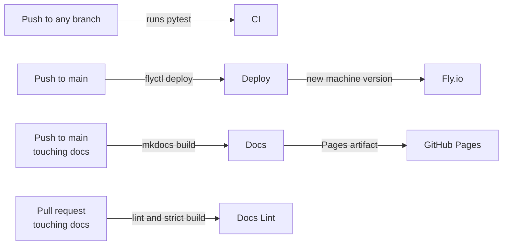

# CI/CD

Four GitHub Actions workflows. Two look after the application, two look after this
documentation site.



## Application workflows

### CI

`.github/workflows/ci.yml` runs on every push, every pull request, and on demand. It
installs the package with its test extra on Python 3.13 and runs `pytest`.

```yaml title=".github/workflows/ci.yml"
permissions:
  contents: read

jobs:
  test:
    runs-on: ubuntu-latest
    timeout-minutes: 10
```

The tests run against `tests/fixtures/` only. **Certification scans and scraping never
happen in CI** — the deployed server performs all certification work. That is a deliberate
boundary: the repository holds no roster, no member IDs, and no credentials, so a workflow
has nothing to leak.

### Deploy

`.github/workflows/deploy.yml` runs on a push to `main` and on demand. It checks out the
repository, installs `flyctl`, and runs `flyctl deploy --remote-only`, so the image is
built on Fly's builders rather than on the runner.

Authentication is a `FLY_API_TOKEN` repository secret, which should be a deploy token
scoped to this application rather than a personal organisation token. A `concurrency` group
named `deploy` with `cancel-in-progress: false` prevents two deployments overlapping.

!!! warning
    Two things about this workflow are worth knowing before you push.

    It does not depend on CI. A commit whose tests fail still deploys, because the two
    workflows are independent jobs triggered by the same event.

    It has no `paths` filter. A commit that changes only documentation still rebuilds the
    image and redeploys the machine.

    Both are recorded in the project's internal defect log rather than fixed, because the
    fix is a policy choice about how much friction a deployment should have.

## Documentation workflows

Both are thin callers. All build logic lives in
[`willtheorangeguy/mkdocs`](https://github.com/willtheorangeguy/mkdocs), so a fix there
reaches every documentation site on its next build.

### Docs

`.github/workflows/docs.yml` runs on a push to `main` that touches `docs/`, `overrides/`,
or `mkdocs.yml`, and calls the shared `docs-build.yml`. It builds the site with
`mkdocs build --strict` and deploys the artifact to GitHub Pages.

It needs three permissions, granted by the caller because a reusable workflow cannot grant
its own:

```yaml
permissions:
  contents: read
  pages: write
  id-token: write
```

The deploy step fails with a confusing OIDC error if any of them is missing.

The `concurrency` group is `pages` with `cancel-in-progress: false`. A deployment is never
cancelled mid-flight, because a half-published site is worse than a slightly stale one.

### Docs Lint

`.github/workflows/docs-lint.yml` runs on pull requests that touch the documentation. It
checks markdown style, performs a strict build, and checks external links. It never
deploys.

## Building the docs locally

Reproduce what CI does, including the staged design system:

```bash
git clone --depth 1 https://github.com/willtheorangeguy/mkdocs .mkdocs-shared
pip install -r .mkdocs-shared/shared/requirements-docs.txt
mkdir -p docs/stylesheets docs/javascript overrides/.icons
cp -r .mkdocs-shared/design-system/stylesheets/. docs/stylesheets/
cp -r .mkdocs-shared/design-system/javascript/. docs/javascript/
cp -rn .mkdocs-shared/design-system/overrides/. overrides/
cp -rn .mkdocs-shared/design-system/icons/. overrides/.icons/
mkdocs build --strict
```

The staged directories are gitignored. A committed copy would freeze this repository on an
old version of a shared file and the site would drift from the rest.

The build must exit with zero warnings. `--strict` catches broken internal links, orphaned
pages, bad anchors, and macro errors, so a rename that breaks a link fails CI instead of
shipping a 404.

## Secrets

| Secret | Used by | Notes |
|---|---|---|
| `FLY_API_TOKEN` | Deploy | A deploy token scoped to the `ucac-certs` app |

Nothing else is needed. Application secrets — the session key, the manager allowlist, and
the Resend key — live on Fly and are never read by a workflow. See
[Deployment](deployment.md).

{{ support() }}
